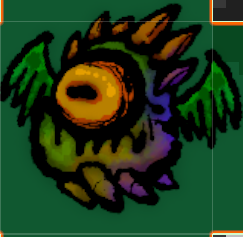
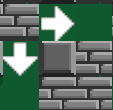

# Chapitre 10 : Défis de Création de Maps Avancées 🎮
## Introduction aux Défis 🚀

Bienvenue dans ce chapitre bonus dédié à la création de maps avancées pour votre jeu ! Vous aurez l'opportunité de relever deux défis passionnants :

Ajouter des Monstres 👾 : Intégrer des créatures animées dans votre jeu, avec des comportements variés et des interactions captivantes avec les joueurs.
Ajouter des Propulseurs de Bombes 💣 : Introduire des mécanismes innovants qui lanceront les bombes d'un endroit à un autre, ajoutant ainsi une couche stratégique aux parties.

Pour ces défis, nous vous donnons seulement la trame à suivre, vous laissant le soin d'implémenter les solutions par vous-même. Considérez cela comme un exercice test pour mettre à l'épreuve vos compétences et votre créativité. Prêt(e) à relever le défi ? C'est parti !🎉

## Defi 1 : Ajouter des Monstres 👾👾

### Code des monstres 👾👾
Voici le code dont vous aurez besoin pour réaliser les étapes.
[MobRevive.txt](https://github.com/user-attachments/files/16815555/MobRevive.txt)

### Création et Animation des Monstres 🎨
- Défi : Importer et animer un sprite de monstre 🖼️
  - Objectif : Importer un sprite de monstre et créer une animation pour ses actions (marche, attaque, etc.) 🎬

- Défi : Implémenter le comportement des monstres 🤖
  - Objectif : Faire en sorte que les monstres patrouillent. 🕵️‍♂️

### Interaction Monstres-Joueurs ⚔️
- Défi : Gestion des collisions avec le joueur 💥
  - Objectif : Faire en sorte que les collisions entre monstres et joueurs réduisent la vie du joueur. 💔

- Défi : Effets des attaques des monstres 🎸
  - Objectif : Implémenter les effets visuels et audio lorsque le monstre attaque le joueur. 🎶

### Points de Réapparition des Monstres 🏞️
- Défi : Permettre la réapparition du monstre 📍
  - Objectif : réapparition du monstre après un certain passage pour les monstres . 🗺️
 
## Défi 2 : Ajouter des Propulseurs de Bombes 💣

### Code des Propulseurs de Bombes 💣
Voici le code dont vous aurez besoin pour réaliser les étapes.
[BombMover.txt](https://github.com/user-attachments/files/16816855/BombMover.txt)

### Organisation des Layers et Tags 📋🏷️

Définir les Layers et Tags :

Vous devez créer les layers et tags nécessaires pour les différents objets de votre jeu (comme Bomb, Player, Obstacle, explosion).

Assignez correctement les layers et tags à chaque objet de la map.

### Configuration de la Map 🗺️

Créer un Tilemap pour chaque direction de propulsion :
- Tilemap pour propulseur vers le haut
- Tilemap pour propulseur vers le bas
- Tilemap pour propulseur vers la gauche
- Tilemap pour propulseur vers la droite

Ajoutez un TilemapCollider2D pour chacun de ces tilemaps et cochez la case Is Trigger.

### Propulseurs sur la Map :

Ajoutez sur votre carte des objets représentant les propulseurs.
Assurez-vous que chaque propulseur utilise le bon Tilemap en fonction de la direction de propulsion souhaitée.
Ajoutez des colliders (avec Is Trigger) sur ces propulseurs qui activeront la propulsion de la bombe.

# Félicitation 🎉

Bravo à tous pour avoir réussi à créer votre propre version du jeu Bomberman avec des fonctionnalités complètes ! Quel parcours impressionnant. 
🎮 Continuez à créer, à innover et surtout à vous amuser avec le développement de jeux vidéo ! 🚀

Encore félicitations ! 🎊👏🔝
