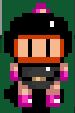
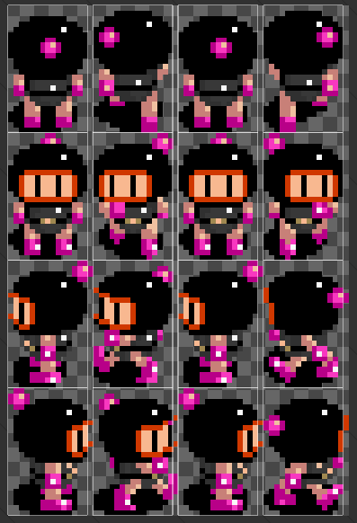
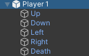

# Chapitre 3 : Personnage Joueur 🕺
Dans ce chapitre, nous allons créer et animer notre personnage joueur en suivant la bonne architecture. Le personnage aura cinq états distincts (UP, Down, Left, Right, Death) et deux scripts géreront les animations et les déplacements. 🚀

## Partie 1 : Création et Organisation du Personnage Joueur

### Étape 1 : Importer et Découper les Sprites du Personnage 🎨

#### Importer les Sprites :
Importez les sprites de votre personnage dans Unity (assurez-vous d'avoir des sprites pour chaque état du personnage).
Organisez les sprites dans un dossier nommé Sprites.

#### Découper les Sprites pour l'Animation ✂️ :
Sélectionnez votre sprite sheet dans le panneau Projet.
Dans l’Inspecteur, changez le mode Sprite en "Multiple" et cliquez sur Sprite Editor.
Utilisez l'outil de découpe pour diviser le sprite sheet en de multiples sprites individuels.
Cliquez sur Slice, ajustez les paramètres si nécessaire, puis cliquez sur Apply.

### Étape 2 : Créer le GameObject du Joueur 🕹️

#### Créer le GameObject :
Dans la Hiérarchie, clic droit > Create Empty.
Renommez ce GameObject en Player1.

#### Ajouter les Etats de Sprites :
Dans Player1, créez cinq GameObjects enfants :
UP
DOWN
LEFT
RIGHT
DEATH
Pour chaque GameObject enfant, ajoutez un Sprite Renderer et assignez le premier sprite correspondant.

### Étape 3 : Configurer les Colliders et Rigidbody ⚙️

#### Ajouter un Collider :
Sélectionnez Player1.
Ajoutez un composant Circle Collider 2D.
Ajustez les dimensions du collider pour qu'il corresponde à la taille du personnage.

#### Ajouter un Rigidbody :
Ajoutez un composant *Rigidbody 2D* à Player1.
   
Réglez la propriété Body Type sur Dynamic.

## Partie 2 : Assigner les Scripts d'Animation et de Déplacement 📜

#### Création de AnimatedSpriteRenderer.cs

Créer le script AnimatedSpriteRenderer et complète le.
[AnimatedSpriteRenderer.txt](https://github.com/user-attachments/files/16747384/AnimatedSpriteRenderer.txt)

Voici des indices:

- animationFrame
- Length
- NextFrame
- enabled
- GetComponent
- NextFrame
- Length
- enabled
- idleSprite

#### Organisation des Sprites 🗂️ :
Assurez-vous que les Components des GameObjects UP, DOWN, LEFT, RIGHT et DEATH soient désactivés par défaut, sauf l’état initial (par exemple, DOWN).

### Étape 1 : Assigner le Script d'Animation 🎥

Sélectionnez UP, DOWN, LEFT, RIGHT et DEATH .
Ajoutez le composant AnimatedSpriteRenderer depuis le dossier Scripts.
Dans l'Inspecteur, assignez les GameObjects aux champs correspondants du script.

### Étape 2 : Assigner le Script de Déplacement 🚶‍♂️

#### Script de Déplacement :
Créer le script MovementController et complète le. [MovementController.txt](https://github.com/user-attachments/files/16749228/MovementController.txt)

#### Assigner le Script :
Sélectionnez Player1.
Ajoutez le composant MovementController depuis le dossier Scripts.
Dans l'Inspecteur, assignez les GameObjects aux champs correspondants du script.

# Conclusion 🌟

Vous avez maintenant un personnage joueur correctement configuré et organisé avec des états distincts, et vous avez assigné les scripts nécessaires pour gérer les animations et les déplacements. Dans les prochains chapitres, nous continuerons à enrichir notre jeu avec des fonctionnalités supplémentaires. Préparez-vous pour [la suite ! 🚀🎮](https://github.com/g404-code-gaming/Bomberman2D/blob/main/Création-Du-Jeu/4.Implémentation%20des%20Bombes.md)

