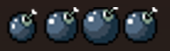
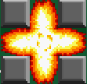

# Chapitre 4 : Implémentation des Bombes 💣
Dans ce chapitre, nous allons ajouter une mécanique essentielle pour notre jeu Bomberman : les bombes et leurs explosions. Ce chapitre est divisé en deux parties : la création des bombes et la gestion des explosions.

## Partie 1 : Création des Bombes

### Étape 1 : Importer et Découper les Sprites 📥✂️

#### Importer les Sprites de la Bombe :
Importez les sprites des bombes dans Unity (veillez à inclure toutes les phases de l'animation).
Organisez les sprites dans un dossier nommé Sprites.

#### Découper les Sprites pour l'Animation ✂️ :

Sélectionnez votre sprite sheet de la bombe.
Dans l’Inspecteur, changez le mode Sprite en "Multiple" et ouvrez le Sprite Editor.
Utilisez l'outil de découpe pour diviser le sprite sheet en plusieurs sprites individuels.
Cliquez sur Slice, ajustez les paramètres si nécessaire, puis cliquez sur Apply.

### Étape 2 : Créer l'Animation de la Bombe 🎥

#### Configurer le GameObject de la Bombe :
Clic droit dans la Hiérarchie > Create Empty et nommez-le Bomb.
Ajoutez un composant Sprite Renderer et assignez l'animation de la bombe.
Ajoutez le script qui gère l'animation (AnimatedSpriteRenderer). Complétez les paramètres du script.

#### Ajouter les Colliders :
Ajoutez un composant Circle Collider 2D pour détecter les collisions.
Ajustez les dimensions du collider pour qu'il corresponde à la taille de la bombe.

### Étape 3 : Assigner le Script de la Bombe

#### Assigner le Script :
Créer le script Bomb et complète le.  [BombController.txt](https://github.com/user-attachments/files/17444486/BombController.2.txt)
Important : Lors de l'ajout de ce script, il est essentiel de revoir et compléter le script MouvementController pour assurer une intégration cohérente et fonctionnelle des mouvements. Le formateur va vous dicter ce que vous devez rajouter, à vous de comprendre et de le transformer en code.

Attention, le code vous laissera une erreur pour le "public Explosion ExplosionPrefab;" car on va le créer à la suite de ce chapitre.

Sélectionnez le GameObject Player et ajoutez le script Bomb.

#### Création du Prefab de la Bombe :
Glissez le GameObject Bomb dans le dossier Prefabs pour le convertir en prefab.

## Partie 2 : Gestion des Explosions

### Étape 1 : Importer et Découper les Sprites 📥✂️

#### Importer les Sprites d'Explosion :
   
Importez les sprites des explosions dans Unity.
Organisez les sprites dans un dossier nommé Sprites.

#### Découper les Sprites pour l'Animation ✂️ :
   
Sélectionnez votre sprite sheet d'explosion.
Dans l’Inspecteur, changez le mode Sprite en "Multiple" et ouvrez le Sprite Editor.
Utilisez l'outil de découpe pour diviser le sprite sheet en plusieurs sprites individuels.
Cliquez sur Slice, ajustez les paramètres si nécessaire, puis cliquez sur Apply.

### Étape 2 : Créer et Configurer le GameObject d'Explosion 🎥

#### Créer le GameObject d'Explosion :

Clic droit dans la Hiérarchie > Create Empty et nommez-le Explosion.
Ajoutez un composant Box Collider 2D.

#### Créer les GameObjects Enfants :
   
Dans Explosion, créez trois GameObjects enfants :

- Start
- Middle
- End

#### Pour chaque GameObject enfant :
Ajoutez un Sprite Renderer et un box collider sur le GameObject parent.
Ajoutez le script qui gère l'animation sur les GameObjects enfants (AnimatedSpriteRenderer).
Complétez les paramètres du script pour chaque GameObject correspondant (Start, Middle, End).
Désactiver les components de ces GameObjects

### Étape 3 : Assigner le Script d'Explosion 📜

#### Assigner le Script :
   
Créer le script Explosion et complète le. [Explosion.txt](https://github.com/user-attachments/files/16758933/Explosion.txt)

Sélectionnez le GameObject Explosion et ajoutez le script Explosion.

#### Création du Prefab d'Explosion :

Glissez le GameObject Explosion dans le dossier Prefabs pour le convertir en prefab.

## Conclusion 🌟

Après avoir implémenté les bombes et leurs explosions, nous allons maintenant nous concentrer sur l'impact de ces [explosions sur les murs](https://github.com/g404-code-gaming/Bomberman2D/blob/main/Création-Du-Jeu/5.Plateformes%20à%20Détruire.md) et autres éléments destructibles du jeu. 💣🔥🚀

