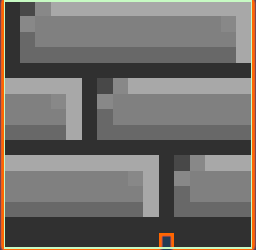
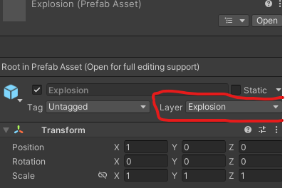
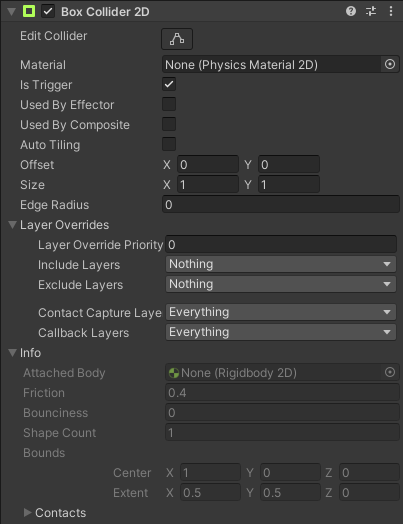

# Chapitre 5 : Plateformes à Détruire 🌐

Dans ce chapitre, nous allons ajouter des plateformes destructibles à notre jeu. Les plateformes réagiront aux explosions des bombes et seront détruites en conséquence.

### Étape 1 : Ajouter des Plateformes Destructibles

#### Importer les Sprites des Plateformes Destructibles 📥
Importez les sprites de vos plateformes destructibles dans Unity.
Organisez les sprites dans un dossier nommé Sprites.

#### Créer le GameObject de la Plateforme Destructible 🧱

Clic droit dans la Hiérarchie sur le Gameobject parent "Stage" > Create Empty et nommez-le Destructible.
Ajoutez un composant Sprite Renderer et assignez le sprite de la plateforme destructible.
Ajoutez un composant Box Collider 2D pour gérer les collisions.

#### Assignez le script d'annimation 🏷️

Ajouté le component AnimatedSpriteRenderer et compléter les variables par les sprites pour créer ton animation.

### Étape 2 : Gérer les Collisions et Destructions 🌟

#### Assigner le Script :
Crée le nouveau script Destructible et compléter le script.

Instructions :
Maintenant, c'est à votre tour de jouer ! Essayez de créer le script pour les éléments destructibles. Utilisez les indications ci-dessous pour vous guider. Rappelez-vous, ce script pourra être amélioré ultérieurement.

Indications pour le script Destructible :
 1. Créez une nouvelle classe Destructible qui hérite de MonoBehaviour.

 2. Déclarez une variable publique destructionTime de type float. Celle-ci déterminera le temps après lequel l'objet sera détruit.

 3. Implémentez la méthode Start qui sera appelée au démarrage. Utilisez la méthode Destroy pour détruire l'objet après destructionTime.

Sélectionnez le GameObject Destructible et ajoutez le script Destructible.

#### Configurer les Layers et Colliders 🏷️

Assurez-vous que le GameObject Explosion ou ses parties ont le layer Explosion pour que les collisions soient détectées correctement.

Ajustez les paramètres des colliders pour qu'ils détectent les collisions entre les explosions et les plateformes.

#### Créer le Prefab 🛠️
Glissez le GameObject Destructible dans le dossier Prefabs pour le convertir en prefab.

## Conclusion 🌟

Vous avez maintenant ajouté des plateformes destructibles à votre jeu. Ces plateformes réagiront aux explosions des bombes et seront détruites lorsqu'elles seront touchées. Continuez à enrichir votre jeu en ajoutant des fonctionnalités supplémentaires comme [des Power Up !](https://github.com/g404-code-gaming/Bomberman2D/blob/main/Création-Du-Jeu/6.powerUp.md) 🌐💣🚀
