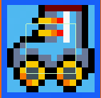
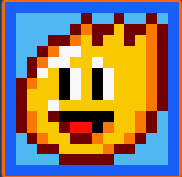
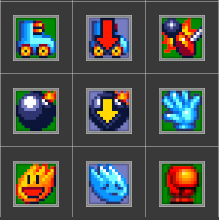

# Chapitre 6 : Les Power-Ups 💥
Dans ce chapitre, nous allons ajouter deux types de power-ups à notre jeu : Speed Up et Blast Radius Up. À la fin de ce chapitre, vous aurez un défi pour créer vos propres power-ups. 

## Étape 1 : Créer le Power-Up "Speed Up" 🚀

Importer les Sprites des Power-Ups 📥

Importez les sprites pour le power-up Speed Up dans Unity.

Organisez les sprites dans un dossier nommé Sprites.

#### Créer le GameObject du Power-Up Speed Up 🌟
Clic droit dans la Hiérarchie > Create Empty et nommez-le SpeedUpPowerUp.
Ajoutez un composant Sprite Renderer et assignez le sprite du power-up Speed Up.
Ajoutez un composant Box Collider 2D et cochez l'option Is Trigger.

#### Assigner le Script :
Créer le script ItemPickUp et remplie le. [ItemPickUp.txt](https://github.com/user-attachments/files/16762848/ItemPickUp.txt)

Sélectionnez le GameObject SpeedUpPowerUp et ajoutez le script ItemPickUp.

#### Créer le Prefab 🛠️
Glissez le GameObject SpeedUpPowerUp dans le dossier Prefabs pour le convertir en prefab.

### Étape 2 : Créer le Power-Up "Blast Radius Up" 💥

Importer les Sprites des Power-Ups 📥

Importez les sprites pour le power-up Blast Radius Up dans Unity.

Organisez les sprites dans un dossier nommé Sprites.

#### Créer le GameObject du Power-Up 
Blast Radius Up 🌟
Clic droit dans la Hiérarchie > Create Empty et nommez-le BlastRadiusUpPowerUp.
Ajoutez un composant Sprite Renderer et assignez le sprite du power-up Blast Radius Up.
Ajoutez un composant Box Collider 2D et cochez l'option Is Trigger.

#### Assigner le Script :
Le script ItemPickUp est déjà créé.

Sélectionnez le GameObject BlastRadiusUpPowerUp et ajoutez le script ItemPickUp.

#### Créer le Prefab 🛠️
Glissez le GameObject BlastRadiusUpPowerUp dans le dossier Prefabs pour le convertir en prefab.

## Défi : Créez Vos Propres Power-Ups et Malus 🚀💡

À la fin de ce chapitre, vous aurez le défi de créer d'autres power-ups par vous-même. Les étapes seront similaires à celles que nous avons suivies pour Speed Up et Blast Radius Up. Voici quelques idées de power-ups supplémentaires que vous pourriez essayer :
- Extra Bombs : Augmente le nombre de bombes que le joueur peut placer.
- Speed Down : réduire la vitesse du joueur.

#### Conclusion 🌟

Après avoir implémenté des power-ups qui ajoutent des compétences et des capacités au personnage, il est temps de rendre l'expérience de jeu encore plus excitante en intégrant la possibilité de jouer à [plusieurs en local.](https://github.com/g404-code-gaming/Bomberman2D/blob/main/Création-Du-Jeu/7.MultijoueurLocal.md) 🚀💥🔋

