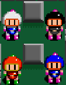

# Chapitre 7 : Multijoueur Local 🎮
Dans ce chapitre, nous allons ajouter un mode multijoueur local pour permettre à deux joueurs de jouer simultanément. Nous allons dupliquer le personnage joueur existant, changer les contrôles d'entrée pour les autres joueurs et créer un GameManager pour gérer le jeu.

## Étape 1 : Dupliquer le Personnage Joueur 👾👾

#### Dupliquer le GameObject du Joueur :
Sélectionnez le GameObject Player1 dans la Hiérarchie.
Faites un clic droit > Duplicate et renommez la copie en Player2.

## Étape 2 : Changer les Inputs ⌨️

#### Configurer les Inputs pour le Second Joueur :
Ouvrez le script PlayerMovement sur Player2.
Changez les contrôles d'entrée pour le deuxième joueur. Par exemple, utilisez les touches I, J, K, L pour les mouvements et une autre touche pour poser une bombe.
Assurez-vous de configurer ces inputs dans la section Input Manager de Unity (Edit > Project Settings > Input).

## Étape 3 : Créer un GameManager 🎮

#### Créer le GameObject GameManager :
Clic droit dans la Hiérarchie > Create Empty et nommez-le GameManager.
Ajoutez le script GameManager au GameObject GameManager.

#### Configurer le Script GameManager :
Créer le script GameManager et complète le. [GameManager.txt](https://github.com/user-attachments/files/16763076/GameManager.txt)

Remarque : Vous aurez besoin d'appeler la fonction CheckWinState quelque part dans le script de votre personnage. C'est à vous de déterminer l'endroit approprié pour placer cet appel afin d'assurer le bon fonctionnement du jeu.

# Conclusion 🌟

Vous avez maintenant ajouté un mode multijoueur local pour votre jeu. En dupliquant les personnages, en modifiant les contrôles pour le deuxième joueur et en utilisant un GameManager, vous avez rendu le jeu beaucoup plus attrayant et compétitif ! 🎮👾👾

Maintenant que nous avons implémenté un mode multijoueur local permettant à plusieurs joueurs de s'affronter dans des parties intenses, il est temps de simplifier la navigation et les options de notre jeu en créant un [menu principal](https://github.com/g404-code-gaming/Bomberman2D/blob/main/Création-Du-Jeu/8.InterfaceEtMenu.md). Ce menu offrira aux joueurs une interface intuitive pour lancer des parties, ajuster les paramètres et accéder à d'autres fonctionnalités du jeu.

