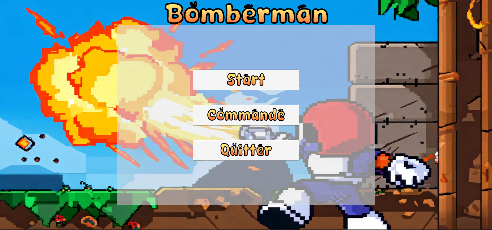
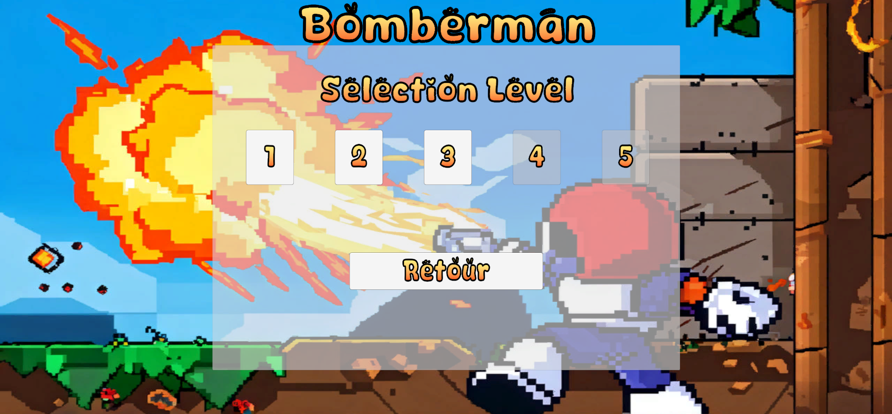

# Chapitre 8 : Interface et Menus 🎮📋
Dans ce chapitre, nous allons créer des interfaces de menu pour améliorer l'expérience utilisateur. Nous allons créer trois interfaces principales : le menu principal, le menu de sélection de niveau et le menu des commandes. 

## Étape 1 : Créer le Menu Principal 🏠

### Créer le Canvas :
Clic droit dans la Hiérarchie > UI > Canvas et nommez-le MainMenuCanvas.
Ajoutez un Panel à ce canvas pour contenir les boutons.

### Ajouter les Boutons au Menu Principal :
À l'intérieur du Panel, ajoutez trois boutons et nommez-les respectivement StartButton, CommandsButton, et QuitButton.
Ajustez les textes des boutons pour afficher "Start", "Commandes", et "Quitter".

### Configurer les Actions des Boutons :
Assignez une action à chaque bouton dans le script MainMenuManager :
- StartButton : Afficher le menu de sélection de niveau.
- CommandsButton : Afficher le menu des commandes.
- QuitButton : Quitter le jeu.

## Étape 2 : Créer le Menu de Sélection de Niveau 🌍

### Créer un Nouveau Panel pour le Sélection de Niveau :
Clic droit dans la Hiérarchie > UI > Panel et nommez-le LevelSelectCanvas.
Ajoutez un Panel à ce canvas pour contenir les boutons de niveau.

### Ajouter les Boutons de Niveau :
À l'intérieur du Panel, ajoutez un bouton pour chaque niveau du jeu. Par exemple, nommez les boutons Level1Button, Level2Button, etc.
Ajustez les textes des boutons pour indiquer les niveaux respectifs (par exemple, "Niveau 1", "Niveau 2", etc.).

### Configurer les Actions des Boutons de Niveau :
Chaque bouton doit charger la scène correspondante lorsque cliqué. Cela sera géré par le nouveau script LevelSelectManager.

## Étape 3 : Créer le Menu des Commandes 🎮📝

### Créer un Nouveau Panel pour le Menu des Commandes :
Clic droit dans la Hiérarchie > UI > Panel et nommez-le CommandsCanvas.
   
Ajoutez un Panel à ce canvas pour contenir les instructions de commandes.

### Ajouter les Textes de Commandes :
À l'intérieur du Panel, ajoutez des Textes UI qui décrivent les commandes pour chaque joueur. Par exemple, un texte pour Player 1 Controls, Player 2 Controls, etc.

### Configurer le Bouton de Retour :
Ajoutez un Button pour revenir au menu principal. Nommez-le BackButton et ajustez son texte pour afficher "Retour".
Assignez une action à ce bouton dans le script CommandsManager pour revenir au menu principal.

# Conclusion 🌟

 Maintenant que vous avez appris à créer des menus et à naviguer entre eux, passons aux défis du chapitre bonus. Vous allez créer deux nouvelles maps : l'une avec des propulseurs de bombes et l'autre avec des monstres. À vous de jouer !🎮📋💻
