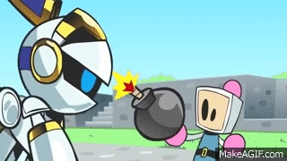

# Bomberman2D 💣🎉

Bienvenue dans ce cours passionnant où nous allons nous plonger dans le développement de jeux vidéo en créant notre propre version de Bomberman avec Unity ! 🎮

## Histoire de Bomberman 🕹️

Bomberman est un classique intemporel des jeux vidéo, développé par Hudson Soft et lancé à l'origine en 1983. Le jeu a fait ses débuts sur des plateformes comme le Ness et le NES et a rapidement captivé l'imagination des joueurs du monde entier. Avec son gameplay simple mais addictif, Bomberman est devenu un incontournable des soirées de jeu entre amis et des compétitions multijoueurs. 💣🎉

Dans Bomberman, les joueurs se déplacent à travers des labyrinthes, posent des bombes pour détruire des obstacles et affrontent des ennemis tout en essayant de ne pas se faire exploser eux-mêmes. Le but ultime ? Surprendre ses adversaires, collecter des power-ups et devenir le dernier survivant. 🚀⚔️

## Objectif du Cours 🎓

Ce cours est spécialement conçu pour les débutants qui souhaitent apprendre à créer des jeux vidéo avec Unity. Pas besoin de compétences avancées en programmation ou en développement de jeux ; nous allons tout explorer étape par étape, de manière claire et pédagogique. 🏫📚

## Ce Que Vous Allez Accomplir 👾

En suivant ce cours, vous allez apprendre à :

Maîtriser Unity : De l'installation à la configuration initiale, vous serez à l’aise avec l’interface et les outils fondamentaux de Unity. 🛠️
- Créer une Map de Jeu : Construisez des labyrinthes, placez des murs destructibles et indestructibles, et donnez vie à votre terrain de jeu. 🌍
- Animer un Personnage Joueur : Apprenez à animer et contrôler votre personnage, à gérer ses mouvements, et ses interactions avec l’environnement. 🕺
- Implémenter des Bombes : Posez des bombes, gérez les temporisations et les explosions, et assurez-vous qu’elles interagissent correctement avec les différents éléments du jeu. 💣
- Intégrer des Power-Ups : Donnez un coup de pouce à vos joueurs avec des power-ups qui leur permettront d'augmenter leurs capacités de jeu. 🚀
- Ajouter des Fonctionnalités Multijoueur Local: Développez des fonctionnalités multijoueur pour que vos amis puissent se joindre à l’aventure et jouer ensemble. 👥
- Créer des Menus de Jeu : Créez des interfaces utilisateur intuitives et élégantes pour naviguer entre les différentes options et paramètres du jeu. 📋
- Explorer des Contenus Bonus : Ajoutez des ennemis, des obstacles supplémentaires, et de nouvelles mécaniques de jeu pour rendre votre Bomberman unique et encore plus amusant. ⭐

## Prêt pour l'Aventure ? 🌟

Préparez-vous à plonger dans l'univers du développement de jeux vidéo et à créer quelque chose d'incroyable. Revenons à l'essentiel du plaisir de jouer, et redécouvrons ce classique sous un nouveau jour grâce à vos propres compétences et créativité. Nous sommes impatients de voir ce que vous allez accomplir ! Allons-y et commençons cette aventure ensemble ! 🌟🎮🚀
